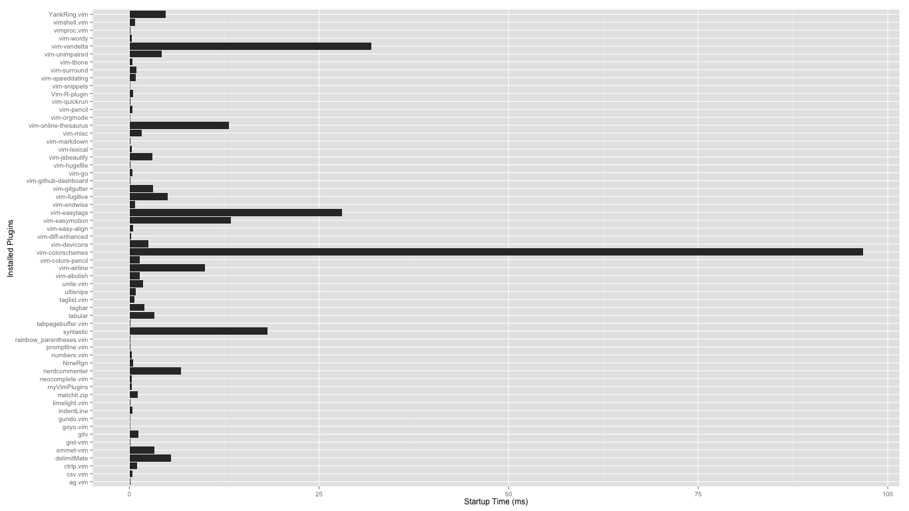

Here is a Screenshot to have a quick look at what this is all about.



Here is a peek at the profiling result for my plugins:

```

Generating vim startup profile...    
Parsing vim startup profile...     
Crunching data and generating profile plot ...    
     
Your plugins startup profile graph is saved     
as `profile.png` under current directory.    
     
==========================================    
Top 10 Plugins That Slows Down Vim Startup    
==========================================    
   1	105.13	"vim-colorschemes"    
   2	42.661	"vim-easytags"    
   3	31.173	"vim-vendetta"    
   4	22.02	"syntastic"    
   5	13.362	"vim-online-thesaurus"    
   6	7.888	"vim-easymotion"    
   7	6.931	"vim-airline"    
   8	6.608	"YankRing.vim"    
   9	5.266	"nerdcommenter"    
  10	5.017	"delimitMate"    
==========================================    
Done!    
```


If you use [vim-plug] to install your vim (gvim or macvim) plugins, then
chances are high that it gets addictive. You will find yourself with
several dozens of useful plugins. 

[vim-plug] offers you to load your plugins on-demand (lazy-loading). But
which needs fine tuning? Well, using vim's built-in profiling `vim
--startuptime` you can get a timing for all function calls during
startup. However, the data is for each functions. You will have to
figure out the math, and make sure those functions calls are form the
same plugins. Even some sorting might help, but sorting the timing for
each functions does not really make sense because it is really time of the
plugins (but not the functions ) that you really care about.  

I am poor at doing mental math, even for simple sums. However, with the power
of a simple bash script and R, we can get all we want.

### Installation

This is *NOT* a vim plugin! This is simply a profiler for your vim
plugins that are installed through [vim-plug].

Download the `.zip` [here](zip) and then simply run the bash script:


```BASH
sh ./vim-plugins-profile.sh
```

Then open the `profile.png` file for the result! It is that simple.

### Dependency

You will need to install several tools before you can run this. Chances
are that you already have them. Here are the list of dependencies:

 - R
 - R:ggplot2  (the ggplot2 package for R)
 - Bash (Cygwin, or Git for Windows will also work)

### TODO

It is very easy to adjust this script to profile your vim plugins that
are installed through Vundle, NeoBundle, Pathogen etc. I do not have
them but we can make a small switch that asks you which plugin you have
(or simply auto-detect).

[zip]: https://github.com/hyiltiz/vim-plugins-profile/archive/master.zip
[vim-plug]: https://github.com/junegunn/vim-plug
